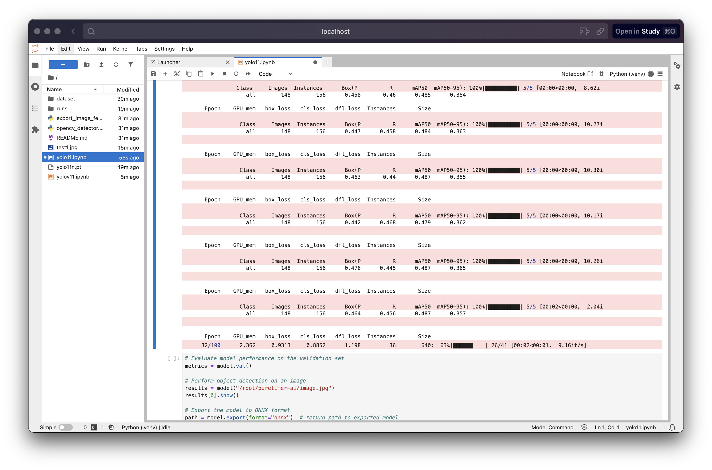

---

>PureTimer [페이지 바로가기](https://puretimer-front.vercel.app)

학습 집중도를 향상시키기 위한 AI 기반 실시간 학습 타이머 웹 플랫폼입니다.  
**YOLOv11** 기반 커스텀 모델 을 활용하여, 카메라를 통해 사용자의 핸드폰 사용 여부를 실시간으로 감지하고, 핸드폰 사용 시 자동으로 타이머를 정지합니다.

1. [PureTimer](#puretimer)
2. [INTRODUCTION](#introduction)
3. [Start](#start)
   - [1️⃣ 루트 페이지](#1️⃣-루트-페이지)
     - [1️⃣-1️⃣ Main 페이지](#1️⃣-1️⃣-main-페이지)
     - [1️⃣-2️⃣ Overview 페이지](#1️⃣-2️⃣-overview-페이지)
     - [1️⃣-3️⃣ About 페이지](#1️⃣-3️⃣-about-페이지)
   - [2️⃣ Auth](#2️⃣-auth)
     - [2️⃣-1️⃣ Login 페이지](#2️⃣-1️⃣-login-페이지)
     - [2️⃣-2️⃣ Create User (회원가입 페이지)](#2️⃣-2️⃣-create-user-회원가입-페이지)
   - [3️⃣ Dashboard](#3️⃣-dashboard)
     - [3️⃣-1️⃣ Home 페이지](#3️⃣-1️⃣-home-페이지)
     - [3️⃣-2️⃣ Study 페이지](#3️⃣-2️⃣-study-페이지)
       - [3️⃣-2️⃣-1️⃣ 기본 공부 상태](#3️⃣-2️⃣-1️⃣-기본-공부-상태)
       - [3️⃣-2️⃣-2️⃣ 일시정지 상태 (사용자 수동 Pause)](#3️⃣-2️⃣-2️⃣-일시정지-상태-사용자-수동-pause)
       - [3️⃣-2️⃣-3️⃣ 핸드폰 감지 상태 (자동 Pause)](#3️⃣-2️⃣-3️⃣-핸드폰-감지-상태-자동-pause)
       - [3️⃣-2️⃣-4️⃣ 종료 상태 (Stop)](#3️⃣-2️⃣-4️⃣-종료-상태-stop)
   - [4️⃣ 마이페이지](#4️⃣-마이페이지)
   - [5️⃣ Setting 페이지](#5️⃣-setting-페이지)
     - [5️⃣-1️⃣ 비밀번호 변경](#5️⃣-1️⃣-비밀번호-변경)
     - [5️⃣-2️⃣ 회원 탈퇴](#5️⃣-2️⃣-회원-탈퇴)
4. [MODEL](#MODEL)
   - [모델 선택 과정](#모델-선택-과정)
   - [커스텀 데이터셋](#커스텀-데이터셋)
5. [LICENSE](#LICENSE)
6. [ARCHITECTURE](#ARCHITECTURE)
   - [프론트엔드 구조 (puretimer-front/)](#프론트엔드-구조-puretimer-front)
   - [백엔드 구조 (puretimer-back/)](#백엔드-구조-puretimer-back)
   - [성능 개선 요소 (프론트엔드)](#성능-개선-요소-프론트엔드)
   - [성능 개선 요소 (백엔드)](#성능-개선-요소-백엔드)
7. [개선 요소](#개선-요소)
8. [Git Repository 목록](#git-repository-목록)
9. [REFERENCES](#REFERENCES)
   - [DEV](#dev)
   - [DESIGN](#design)
   - [USED](#used)

<br />


[](https://example.com)
[](https://example.com)
[](https://example.com)
[](https://example.com)
[](https://example.com)
[](https://example.com)
[](https://example.com)
[](https://example.com)
[](https://example.com)

<br />

# INTRODUCTION

> 📚 PureTimer는 YOLOv11n 모델로 커스텀 학습한 `best.pt` 가중치를 통해 카메라로 사용자의 핸드폰 사용을 실시간 분석하는 웹 플랫폼입니다.

> 🤳 사용자가 핸드폰을 사용할 경우 타이머를 자동으로 멈추어 집중 학습을 지원하며, 학습 과목과 시간, 낭비 시간(핸드폰 사용으로 인한) 등의 데이터를 관리할 수 있습니다.  

> 🚀 또한 다른 사용자와 학습 데이터를 공유하거나, 다양한 그래프를 통해 자신의 학습 지표를 확인하고, 비밀번호 변경, 회원 탈퇴, 로그아웃 등 편의 기능도 제공합니다.  

> 기존 YOLOv3 → YOLOv5를 거쳐 속도 향상과 실시간 분석의 어려움을 해결하기 위해 YOLOv11으로 전환하고, 커스텀 데이터셋으로 학습한 모델을 활용하여 실시간 API 응답 기반 객체 감지를 가능하게 하였습니다.

<br />

# Start

> ❗Local에서 실행 전 `pip install -r requirements.txt`, `npm install` 을 진행해 주세요.

`PureTimer`는 YOLOv11로 커스텀 학습한 모델을 사용해 실시간 카메라 분석으로 사용자의 핸드폰 사용 여부를 판단하고, 이를 통해 학습 타이머를 자동 제어하는 React 기반 웹 플랫폼입니다.

## 1️⃣ 루트 페이지:
  
   
  루트 페이지에서는 프로젝트의 전반적인 내용과 사용된 기술 스택을 확인할 수 있습니다.  
  `PureTimer`는 YOLOv11n 기반 핸드폰 감지를 통해 공부에 집중할 수 있도록 지원합니다.

> 1️⃣-1️⃣ **Main 페이지**:
   - **start 버튼** 클릭 시:  
     🔑 로그인 상태라면 대시보드로 이동  
     🚧 로그인하지 않았다면 로그인 페이지로 리다이렉션

   - **overview 링크** 클릭 시:  
     🔍 프로젝트 개요 및 주요 기능을 확인할 수 있는 페이지로 이동

> 1️⃣-2️⃣ **Overview 페이지**:
   
   - 📷 카메라로 들어온 영상에서 핸드폰이 감지되면, 일정 정확도(conf)가 넘을 경우 타이머가 일시정지됩니다. 이로써 학습 시간 중 핸드폰 사용으로 인한 비효율을 제거하고, 온전히 집중한 공부 시간만 측정할 수 있습니다.

> 1️⃣-3️⃣ **About 페이지**:
   - 📦 **컨테이너 클릭 시**: 사용한 기술 스택을 확인 가능  

   - 🤖 **YOLO**: 핸드폰 감지 사용  

   - 👀 **OpenCV**: 실시간 이미지 처리  

   - ⚛️ **React**: 웹 프론트엔드 구성

## 2️⃣ Auth
  

  이 프로젝트에서는 여러 사용자가 자신의 학습 기록을 게시하고, 다른 사용자들과 학습 현황을 공유할 수 있습니다. 또한 각 사용자의 공부 시간, 과목 등을 다양한 차트로 분석할 수 있으므로, 회원가입과 로그인 과정을 통해 계정 인증이 필요합니다.

> 2️⃣-1️⃣ **Login 페이지**:

  - 🔑 **로그인 시나리오**: 이미 가입한 이메일과 비밀번호를 입력하여 로그인할 수 있습니다.  

  - ❗ **에러 처리**: 잘못된 정보 입력, 미가입 이메일 등의 상황에 대해 유저에게 명확한 에러 메시지를 제공합니다.  

  - 💾 **Current User 저장**: 로그인에 성공하면 현재 사용자 정보가 저장되며, 다음 번에 **Overview** 페이지에서 `start`를 클릭하면 바로 대시보드로 진입할 수 있습니다.

> 2️⃣-2️⃣ **Create User (회원가입 페이지)**:
  - 📧 **이메일 고유성**: 한 이메일당 하나의 계정만 생성 가능하며, 중복 등록은 불가합니다.

  - 🔒 **보안 강화**: 비밀번호는 8자리 해시값으로 암호화되어 SSL 인증서를 통한 안전한 페이로드 전송을 보장합니다.  

  - 📝 **간단한 절차**: 최소한의 정보 입력으로 회원가입을 완료하고, 이후 로그인 후 학습 현황 공유 및 분석 기능을 이용할 수 있습니다.

## 3️⃣ Dashboard

대시보드에서는 여러 사용자의 공부 현황과 과목 정보를 확인할 수 있으며, **Circle Chart** 등의 그래프를 통해 시각적으로 학습 데이터를 파악할 수 있습니다. 또한, 옆에 위치한 **Aside** 메뉴를 통해 다양한 페이지로 손쉽게 이동할 수 있습니다.

> 3️⃣-1️⃣ **Home 페이지**:
  

   - 🏠 **Post 조회**: 자신의 게시글뿐만 아니라 다른 사용자들의 공부 현황(포스트)을 확인할 수 있습니다.

   - 👤 **사용자 정보 표시**: 화면 오른쪽 영역에서 자신의 기본 정보를 간략히 확인할 수 있습니다.

> 3️⃣-2️⃣ **Study 페이지**:

   - 📝 **과목 입력 후 공부 시작**: 빈칸에 학습할 과목을 입력한 뒤 **공부 시작**을 누르면 `PureTimer` 기능이 활성화됩니다.

   - 🎥 **카메라 권한 허용**: 실시간 핸드폰 감지를 위해 카메라 접근 권한이 필요합니다.

   - ❗**공부 활성화 감지**: 공부 도중 Aside를 통해 다른 페이지로 이동 시, 전역 `Context`를 통해 이동이 제재됩니다.

   3️⃣-2️⃣-1️⃣ **기본 공부 상태**:
  

   - 🔵 **파란색 테두리**: 공부 집중 상태  

   - ⏲️ 공부 타이머가 계속 작동하여 순수한 공부 시간을 기록합니다.

   3️⃣-2️⃣-2️⃣ **일시정지 상태 (사용자 수동 Pause)**:
  

   - 🟡 **노란색 테두리**: Pause 버튼을 눌러 타이머를 멈춘 상태  

   - 🔄 이때 공부 타이머는 멈추고 **Waste Timer**(낭비 시간 타이머)가 작동을 시작합니다.

   3️⃣-2️⃣-3️⃣ **핸드폰 감지 상태 (자동 Pause)**:
  

   - 🔴 **빨간색 테두리**: 핸드폰 사용 감지 시, Pause/Resume 관계없이 자동으로 Pause 상태로 전환됩니다.  

   - 📵 핸드폰이 화면에서 사라지기 전까지 재개 버튼이 나타나지 않으며, 핸드폰이 없어지면 다시 Pause 상태로 돌아옵니다.
   
   3️⃣-2️⃣-4️⃣ **종료 상태 (Stop)**:
  


   - 🛑 **Stop 버튼**: 공부 세션을 종료합니다.  

   - 🧮 이 때, 총 공부 시간과 낭비 시간을 계산하여 **mypage**로 이동하여 기록을 확인할 수 있습니다.

## 4️⃣ 마이페이지

`My Page`에서는 사용자의 계정 생성일 및 수정일, 과거 학습 기록(과목, 공부 시간, 낭비 시간 등)을 확인할 수 있습니다.  
📊 다양한 차트를 통해 과거 지표와 비교할 수 있으며, 마우스를 올려놓으면 더 자세한 정보(툴팁)를 확인할 수 있습니다.


> BAR 형태의 차트


> LINEAR 형태의 차트


> TOOLTIP 형태의 차트

## 5️⃣ Setting 페이지

사용자는 셋팅(Setting) 페이지를 통해 계정 정보를 관리할 수 있습니다. 비밀번호 변경 기능과 회원 탈퇴 기능을 제공하여, 유저가 자신의 계정을 안전하고 편리하게 관리할 수 있습니다.

> 5️⃣-1️⃣ **비밀번호 변경**:
   - 🔑 **즉시 적용**: 비밀번호를 변경하면 그 즉시 적용되며, 이후 로그인 시 새로운 비밀번호를 사용해야 합니다.
   - 💂 **보안 강화**: 비밀번호는 8자리 해시값으로 암호화되고, SSL 인증서를 통한 암호화된 페이로드로 전송되어 안전성을 보장합니다.

> 5️⃣-2️⃣ **회원 탈퇴**:
   - 💣 **탈퇴 시 데이터 연계 삭제**: 회원 탈퇴를 진행하면 해당 사용자가 작성한 게시물(post)도 함께 삭제됩니다.
   - 🔄 **MySQL Cascade 활용**: 데이터베이스 관계 설정을 통해 유저 계정 삭제와 동시에 연관된 스터디 세션 기록이 자동으로 제거됩니다.
  

# MODEL

`PureTimer` 프로젝트에서는 실시간 핸드폰 감지를 위해 YOLOv11 기반 모델을 선택하였습니다.  
기존에는 YOLOv3 → YOLOv5로 전환하여 속도를 개선하려 했지만, 여전히 실시간 감지 환경에서 API 통신 문제를 야기할 정도로 충분히 빠르지 않았습니다. 이에 따라 더 개선된 YOLOv11n 모델을 활용하였습니다.

## 모델 선택 과정

- **YOLOv3 & YOLOv5 비교**:  
  YOLOv5 모델이 YOLOv3 대비 속도 향상 측면에서 유리했으나, 실시간 감지 + API 통신 환경에서 여전히 문제를 일으킬 수준의 속도 지연이 존재하였습니다.

- **YOLOv11n 도입**:  
  Ultralytics의 YOLOv11n 모델은 더 나은 성능과 속도를 제공하여, 실시간 핸드폰 감지에 적합한 모델로 선정되었습니다.  
  아래는 [Ultralytics](https://github.com/ultralytics/ultralytics)에서 제공하는 YOLOv11 모델 성능 지표 예시입니다.

| Model    | size (px) | mAP<sup>val</sup> 50-95 | Speed CPU ONNX (ms)  | Speed T4 TensorRT10 (ms) | params (M) | FLOPs (B) |
|----------|------------|-------------------------|----------------------|--------------------------|------------|-----------|
| YOLO11n  | 640        | 39.5                    | 56.1 ± 0.8           | 1.5 ± 0.0               | 2.6        | 6.5       |
| YOLO11s  | 640        | 47.0                    | 90.0 ± 1.2           | 2.5 ± 0.0               | 9.4        | 21.5      |
| YOLO11m  | 640        | 51.5                    | 183.2 ± 2.0          | 4.7 ± 0.1               | 20.1       | 68.0      |
| YOLO11l  | 640        | 53.4                    | 238.6 ± 1.4          | 6.2 ± 0.1               | 25.3       | 86.9      |
| YOLO11x  | 640        | 54.7                    | 462.8 ± 6.7          | 11.3 ± 0.2              | 56.9       | 194.9     |

위 지표를 참고하여 가장 경량화된 YOLO11n 모델을 채택하였습니다.

## 커스텀 데이터셋


핸드폰 감지를 위한 커스텀 데이터셋은 [roboflow](https://universe.roboflow.com/algoconcept/smartphone-images)에서 제공하는 스마트폰 이미지 데이터셋을 사용하였습니다. 해당 데이터셋을 YOLO 포맷으로 변환한 뒤 학습에 활용하였으며, 이를 통해 핸드폰 감지 성능을 극대화하였습니다.

일반적인(Google Open Images, COCO 등) 제너럴 학습 데이터세트를 활용하면 다양한 객체를 감지하게 되어 필요 없는 오브젝트까지 탐지하는 상황이 발생할 수 있습니다.  
이로 인해 모델 성능 및 실시간 처리 효율성이 저하될 수 있으며, PureTimer에서는 **핸드폰 감지**라는 명확한 목표가 존재하므로, 목적에 맞는 **커스텀 데이터셋**을 활용하는 것이 더 효과적이라 판단하였습니다.


<br />

# LICENSE

AI-architect is released under the MIT License, which means you can freely use, modify, distribute, and even use the code commercially. The only requirement is to include the original copyright notice and license text.

```
MIT License
Copyright (c) 2024 Puretimer
```

See the [LICENSE.md](LICENSE.md) file for the full license text.

This license was chosen to:
- Allow maximum freedom for developers and users
- Enable commercial use of the software
- Maintain simplicity in licensing terms
- Promote widespread adoption of the project

<br />

# ARCHITECTURE

위 구조는 `PureTimer` 프로젝트에서 프론트엔드(React+TypeScript)와 백엔드(Flask)로 나누어진 디렉토리 및 파일 배치를 나타냅니다. 이를 통해 각 부분별 역할이 명확히 분리되고, 유지보수 및 확장성이 향상됩니다.

## 프론트엔드 구조 (puretimer-front/)

프론트엔드는 React와 TypeScript 기반으로, 명확한 디렉토리 구조를 통해 역할을 분리하고 있습니다.

```planeText
puretimer-front/
└─ src/
   ├─ assets/
   │  ├─ auth/
   │  ├─ dashboard/
   │  ├─ footer/
   │  └─ landing/
   │
   ├─ components/
   │  ├─ dashboard/
   │  │  ├─ _components/
   │  │  ├─ index.ts
   │  │  ├─ Main.tsx
   │  │  └─ Profile.tsx
   │  ├─ landing/
   │  ├─ mypage/
   │  ├─ setting/
   │  ├─ signin/
   │  ├─ signup/
   │  ├─ study/
   │  └─ ui/
   │     ├─ aside/
   │     ├─ auth/
   │     ├─ chart/
   │     ├─ footer/
   │     ├─ header/
   │     ├─ shadcn/
   │     └─ title/
   │
   ├─ hooks/
   ├─ layouts/
   ├─ lib/
   ├─ pages/
   │  ├─ dashboard/
   │  ├─ landing/
   │  ├─ mypage/
   │  ├─ setting/
   │  ├─ signin/
   │  ├─ signup/
   │  └─ study/
   │
   ├─ provider/
   │  └─ context/
   ├─ router/
   ├─ types/
   ├─ index.css
   └─ main.tsx
```

### 성능 개선 요소 (프론트엔드)

1. **Code Splitting & Lazy Loading**:  
   필요할 때만 특정 페이지나 컴포넌트를 불러와 초기 로딩 속도를 개선할 수 있습니다.
   
2. **Memoization & useCallback/useMemo**:  
   빈번한 재렌더링을 방지하기 위해 props나 state에 따라 재계산이 필요한 부분에 메모화를 적용할 수 있습니다.
   
3. **React Query/ SWR 사용 고려**:  
   API 요청 시 캐싱 및 자동 리프레시 기능을 활용해 네트워크 부하 완화 및 UI 반응성 향상 가능.

4. **정적 파일 최적화**:  
   이미지, 아이콘 최적화(CDN 활용, WebP 등 사용) 및 CSS, JS 번들 사이즈 최소화.

## 백엔드 구조 (puretimer-back/)

백엔드는 Flask 기반의 MVC 패턴을 유지하고 있습니다.

```planeText
puretimer-back/
├─ controller/
│  └─ controller.py
├─ model/
│  └─ model.py
├─ view/
│  └─ view.py
├─ .env
├─ app.py
├─ best.pt
├─ config.py
└─ opencv_detector_yolov11.py
```

### 성능 개선 요소 (백엔드)

1. **비동기 처리/멀티프로세싱**:  
   이미지 처리 요청을 비동기적으로 처리하거나, 필요 시 Celery 또는 멀티프로세스 환경 도입을 고려하여 요청 처리량 증가에 대비할 수 있습니다.
   
2. **캐싱 전략 도입**:  
   자주 조회되는 데이터(예: 사용자 프로필, 정적 데이터)에 대해 Redis 같은 인메모리 캐시를 활용해 응답 속도를 개선할 수 있습니다.
   
3. **DB 인덱싱 & 쿼리 최적화**:  
   DB 스키마를 최적화하고 인덱스를 적절히 추가하여 쿼리 응답 속도를 향상할 수 있습니다.
   
4. **Load Balancing & Scaling**:  
   트래픽이 증가할 경우 로드 밸런싱 또는 수평적 스케일링을 통해 서버 성능을 개선할 수 있습니다.

---

위와 같은 성능 개선 요소를 바탕으로 전체 시스템의 응답 속도와 안정성을 높이고, 실시간 핸드폰 감지라는 핵심 기능을 더욱 원활하게 제공할 수 있습니다.

<br />

# 개선 요소

1. **WebSocket 통신 제약사항 개선**:  
   현재는 AWS 서버 한계로 인해 WebSocket 통신 대신 1초 단위의 이미지 처리 방식으로 구현하고 있습니다. 향후에는 실시간 동영상 스트리밍 방식으로 전환하여, 보다 자연스럽고 지연 없는 감지 기능을 구현하고 싶습니다.

2. **이메일 인증 시스템 보완**:  
   Auth 기능에서 Firebase Authentication의 이메일 인증(Email Verify) 기능을 활용하려 했으나, 개발 기간 상의 이유로 구현하지 못했습니다. 추후 이 기능을 도입하여, 사용자 계정의 신뢰성과 보안을 강화할 계획입니다.

3. **네트워크 및 배포 환경 개선**:  
   현재 AWS 서버의 DNS 문제로 인해 http 통신에 제약이 있어 프록시 설정을 통한 단기 해결책을 사용하고 있습니다. 향후에는 별도의 DNS를 구매하여 HTTPS 환경을 구축하고, Vercel 대신 Nginx 설정을 통해 한 곳에서 통합 관리하는 방식으로 네트워크 및 배포 환경을 개선할 계획입니다.

<br />

# Git Repository 목록

`PureTimer` 프로젝트는 프론트엔드, 백엔드, AI 모델 관련 코드를 각각 별도의 Git 리포지토리로 관리하고 있습니다.

- **프론트엔드 (React/TypeScript)**  
  - Git 주소: [https://github.com/AnTaewoo/puretimer-front.git](https://github.com/AnTaewoo/puretimer-front.git)  
  - **main 브랜치**: 실제 배포에 사용되는 프론트엔드 코드  
  - **local 브랜치**: 로컬 환경에서 테스트할 수 있는 파일들이 포함되어 있음

- **백엔드 (Flask/MVC 구조)**
  - Git 주소: [https://github.com/AnTaewoo/puretimer-back.git](https://github.com/AnTaewoo/puretimer-back.git)

- **AI 모델 (YOLOv11 커스텀 모델)**
  - Git 주소: [https://github.com/AnTaewoo/puretimer-ai.git](https://github.com/AnTaewoo/puretimer-ai.git)

<br />


# REFERENCES

### DEV
- [Typescript](https://www.typescriptlang.org/)
- [React](https://react.dev/)
- [Tailwind css](https://tailwindcss.com/)
- [Shadcn/ui](https://ui.shadcn.com/)
- [Vite](https://vite.dev/)
- [Pytorch](https://pytorch.org/docs/stable/nn.html)
- [ReactHookForm](https://react-hook-form.com/)
- [Flask](https://flask.palletsprojects.com/en/stable/)

### DESIGN
- [Figma - Landing](https://www.figma.com/community/file/1298287435486709856/35-modern-heros-with-gradients-and-mockups)
- [Instagram - Dashboard](https://www.instagram.com/)
- [Facebook - auth](https://www.facebook.com/)

### USED
- [GPT-4](https://openai.com/index/gpt-4/)
- [Claude](https://claude.ai/)